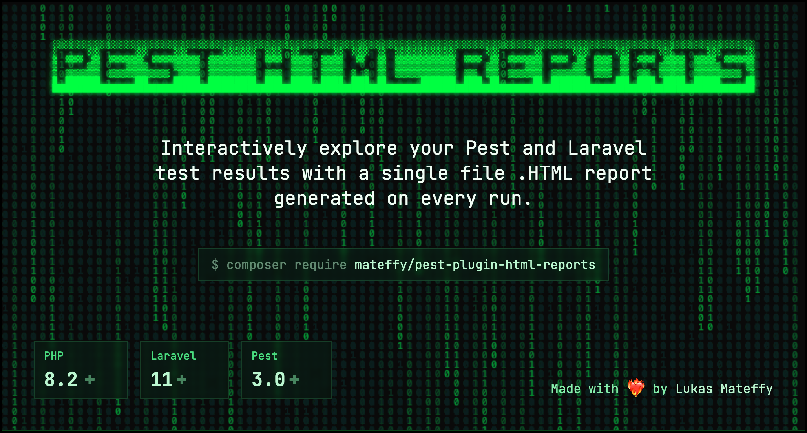
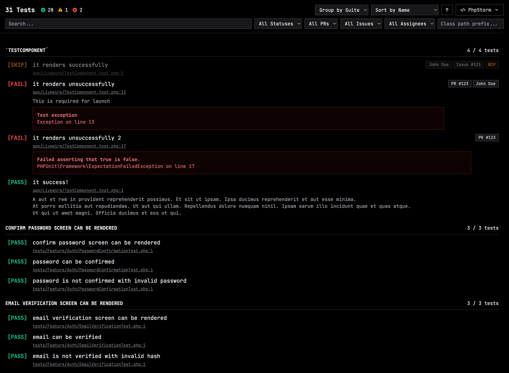

<div class="flex flex-col gap-4" align="center">
	<h1>
		HTML Reports for Pest Tests
	</h1>
	<h5>
		Generate interactive HTML reports from Pest test results.
	</h5>
</div>

## Features

-   Generate static HTML reports from Pest test results JSON
-   Search UI to find test cases and dig deeper than you ever did before
-   Editor deep links (PhpStorm, VS Code, Sublime Text, Vim)
-   GitHub linking for PRs and issues (using Pest's `->todo(issue: 123)` annotations)
-   Use Markdown in your test case notes (`->note('Note with **bold** text')`)
-   HTML report is completely self-contained in a single file (Tailwind + Alpine from CDN)

<br />



<br />

## Installation

Install the package via Composer:

```bash
composer require mateffy/pest-plugin-html-reports
```

<br />

## Usage

### Command Line

Generate a static HTML report from a test results JSON file:

```bash
php artisan test-report:generate \
    --input=storage/app/pest_test_results.json \
    --output=public/pest-report.html \
    --title="My Project Test Results" \
    --project-path=/path/to/your/project \
    --editor=phpstorm \
    --repository=your-username/your-repo
```

<br />

### Environment Variables

You can configure the output directory and filename of the JSON report by setting the following environment variables:

-   `TEST_REPORT_DIR`: The directory where the JSON report will be saved. Defaults to `storage/framework/testing/reports`.
-   `TEST_REPORT_FILENAME`: The filename of the JSON report. Defaults to `report-{{date}}-{{id}}.json`. The `{{date}}` and `{{id}}` placeholders will be replaced with the current date and a unique ID.

<br />

## How it works

1. A Pest test is run
2. A pest plugin is used to listen to the test completion event and loads the required data from the Pest internals
3. The data is then stored as a JSON file per run in the `storage/framework/testing/reports` directory
4. Depending on your configuration, a HTML report is automatically generated and also stored in the `storage/framework/testing/reports` directory. Optionally you can configure the report to open in your browser automatically.
5. Later on, the `artisan test-report:generate` command can be used to generate a static HTML report from any of the historic JSON files
6. Use the `artisan test-report:open` command to open the latest report in your browser

<br />

## License

MIT License
